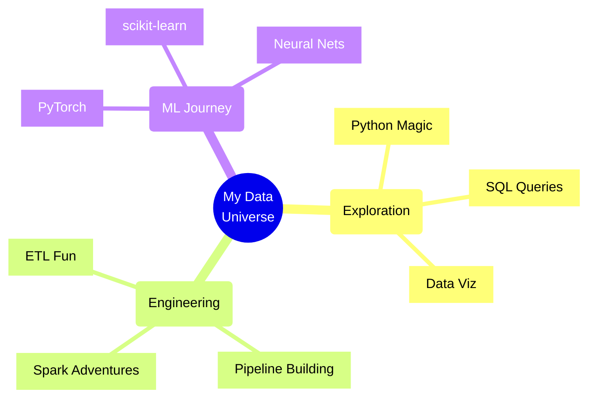

<div align="center">

```ascii
 ___________________
< Data Is My Canvas >
 -------------------
        \   ^__^
         \  (oo)\_______
            (__)\       )\/\
                ||----w |
                ||     ||
```

<div align="center">
  <a href="https://git.io/typing-svg">
    
  </a>
</div>

```python
class DataNerd:
    def __init__(self):
        self.name = "Akshay"
        self.superpower = "Turning Coffee into Insights ☕→📊"
        self.interests = [
            "Finding patterns in chaos 🎲",
            "Building data pipelines 🔧",
            "Training neural networks 🧠",
            "Visualizing the invisible 📈"
        ]
    
    def daily_routine(self):
        while awake:
            coffee.drink()
            data.explore()
            insights.discover()
            if stuck:
                stackoverflow.search()
```

### 🎮 My Data Playground



### 🛠️ Tools I'm Learning & Using

<div align="center">
  <table>
    <tr>
      <td align="center" width="96">
        
        <br>Python
      </td>
      <td align="center" width="96">
        
        <br>PyTorch
      </td>
      <td align="center" width="96">
        
        <br>AWS
      </td>
      <td align="center" width="96">
        
        <br>Docker
      </td>
      <td align="center" width="96">
        
        <br>Databricks
      </td>
    </tr>
    <tr>
      <td align="center" width="96">
        
        <br>Snowflake
      </td>
      <td align="center" width="96">
        
        <br>Spark
      </td>
      <td align="center" width="96">
        
        <br>Kafka
      </td>
      <td align="center" width="96">
        
        <br>TensorFlow
      </td>
      <td align="center" width="96">
        
        <br>Kubernetes
      </td>
    </tr>
    <tr>
      <td align="center" width="96">
        
        <br>PostgreSQL
      </td>
      <td align="center" width="96">
        
        <br>MongoDB
      </td>
      <td align="center" width="96">
        
        <br>Airflow
      </td>
      <td align="center" width="96">
        
        <br>Linux
      </td>
      <td align="center" width="96">
        
        <br>Git
      </td>
    </tr>
  </table>

  <br>
  
  <!-- Additional Tools Badges -->
  <p>
    
    
    
    
    
  </p>
</div>

### 📊 Current Adventures in Data

```python
my_journey = {
    "currently_learning": [
        "Building ML Models 🤖",
        "Data Pipeline Magic ⚡",
        "Cloud Computing ☁️",
    ],
    "excited_about": [
        "Big Data Processing",
        "Neural Networks",
        "Data Visualization"
    ],
    "favorite_algorithms": [
        "Random Forests 🌳",
        "Neural Nets 🧠",
        "Clustering 🎯"
    ]
}
```

### 🎯 My Data Science Journey

<div align="center">

| What I Love | Why I Love It |
|-------------|---------------|
| 📊 Data Analysis | Finding hidden patterns in data is like solving puzzles! |
| 🤖 Machine Learning | Teaching computers to learn? That's literally magic! |
| 🔧 Data Engineering | Building pipelines is like creating digital Lego structures! |
| 📈 Visualization | Making data tell beautiful stories! |

</div>

### ⚡ Fun Facts

```python
# Things that excite me:
excitement = {
    "Clean Data": "As satisfying as organizing your room! 🧹",
    "Successful Model": "Better than coffee! ☕",
    "Pipeline Works": "Pure digital happiness! 🎉",
    "New Algorithm": "Like learning a new spell! 🪄"
}
```

### 🌱 Growing & Learning

<div align="center">
  <!-- GitHub Stats Card -->
  <a href="https://github.com/abheda24">
    
  </a>
  
  <!-- GitHub Streak Stats -->
  <a href="https://github.com/abheda24">
    
  </a>
  
  <!-- Activity Graph -->
  <a href="https://github.com/abheda24">
    
  </a>
</div>

### 🤝 Let's Connect!

<div align="center">
  <a href="https://linkedin.com/in/akshay-bheda9630">
    
  </a>
  <a href="mailto:abheda@stevens.edu">
    
  </a>
</div>

<div align="center">
  
</div>

```python
# Remember:
# Every data scientist started somewhere.
# The journey of a thousand models begins with a single line of code! 🚀
```
